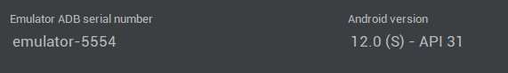
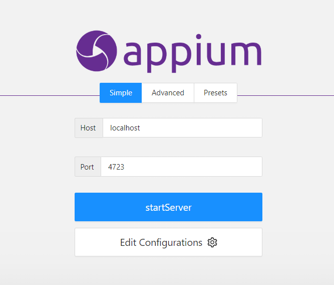
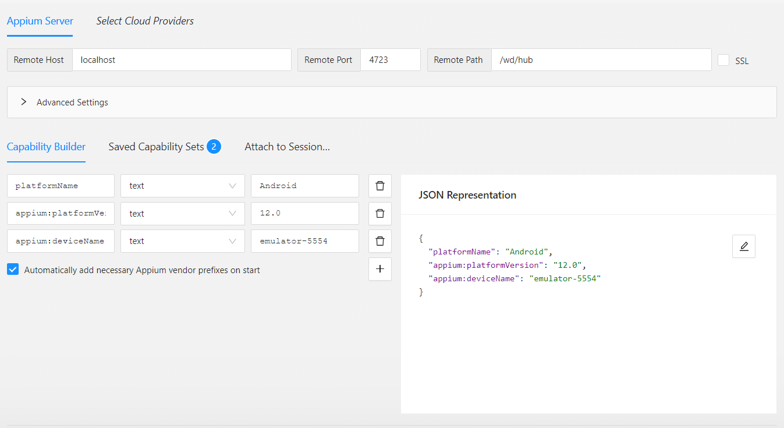

# เนื้อหาโปรเจค
ทดสอบการใช้ Appium Library ในการรันคำสั่งผ่าน Robot Framework โดยมีการใช้ Appium Server ในการเชื่อมต่อกับ Android Studio และใช้ Appium Inspector ในการดู element ต่างๆใน Mobile

# Test Scenario
1.ทดสอบการเข้า setting เพื่อเปิด Airplane Mode ใน Menu Network & Internet \
2.ทดสอบการเปิดการแสดง Battery ใน Menu Battery \
3.ทดสอบการเพิ่ม ภาษาไทย เมนู System > Languages & input > Languages > Add Language >  พิมพ์ th เมื่อภาษาไทยขึ้นมาจึงทำการเพิ่ม \
# Setting

# Emulator Version 

# Appium Server 

# Appium Inspector

 
<pre><code>
{
"platformName": "Android",
"appium:platformVersion": "12.0",
"appium:deviceName": "emulator-5554"
}
</code></pre>

# run

 
  <pre><code>robot Assignment.robot</code></pre>

